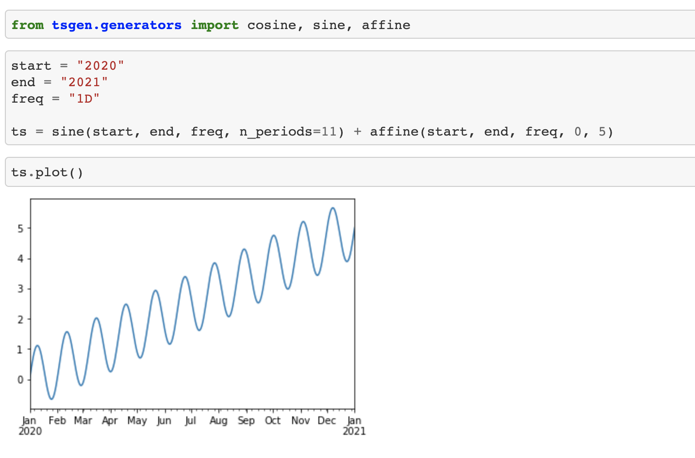

tsgen -  A Time Series Generator
================================

tsgen (for Time Series Generator) is a package developed for educational purposes that helps create unidimensional time series of different shapes.

Installation
=============

You can install tsgen from PyPI using pip:

.. code::

   pip install tsgen

Getting started
===============

For more information, check the :ref:`api-reference`.

.. toctree::
   :maxdepth: 2
   :hidden:

   api_reference

Indices and tables
==================

* :ref:`genindex`
* :ref:`modindex`
* :ref:`search`
